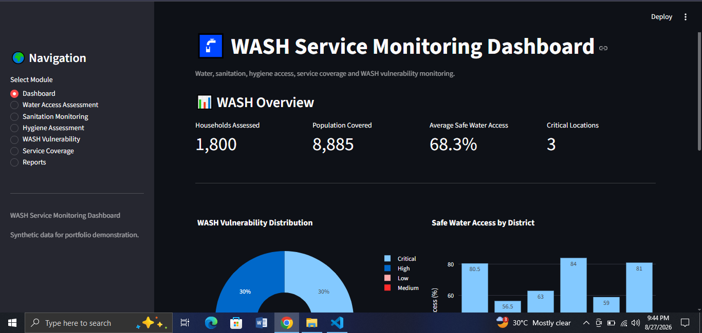

🚰 WASH Service Monitoring Dashboard
An interactive water, sanitation, and hygiene (WASH) service monitoring and vulnerability assessment dashboard built with Python and Streamlit.

🚀 Live Demo

👉 ## 🚀 Live Demo

👉 https://wash-service-monitoring-dashboard.streamlit.app/ 

📸 Dashboard Preview

📌 Project Overview

This project is a comprehensive water, sanitation, and hygiene (WASH) service monitoring dashboard designed to support data-driven decision-making in humanitarian response and public health operations.

The system allows users to assess safe water access, monitor sanitation services, evaluate hygiene conditions, analyze WASH vulnerability, compare service coverage across districts, identify critical locations, and generate monitoring reports.

The project uses synthetic data for educational and portfolio purposes.

🎯 Objectives

Assess safe water access
Monitor sanitation service conditions
Evaluate hygiene practices
Analyze WASH vulnerability
Identify critical and high-risk locations
Monitor service coverage across districts
Track key WASH performance indicators
Identify vulnerable population groups
Prioritize locations for WASH interventions
Generate downloadable monitoring reports
Demonstrate WASH data analysis and visualization

📊 Key Features

🏠 Dashboard Overview
View overall summary of WASH service conditions
Monitor key performance indicators
Track households assessed and population covered
Visualize WASH vulnerability distribution
Compare district-level safe water access

🚰 Water Access Assessment

Assess safe water access levels
Monitor primary water sources
Track water collection distance
Monitor daily water availability
Record functional water points
Track water quality status
Identify water shortages

🚽 Sanitation Monitoring

Monitor sanitation coverage
Track functional toilets
Monitor shared toilets
Track open defecation
Assess sanitation service conditions

🧼 Hygiene Assessment

Monitor handwashing facilities
Track soap availability
Assess hygiene awareness
Monitor menstrual hygiene support
Track hygiene material access

⚠️ WASH Vulnerability Analysis

Calculate WASH vulnerability scores
Classify locations by vulnerability level
Identify critical and high-risk locations
Compare vulnerability across districts

📈 Service Coverage

Evaluate overall WASH service coverage
Compare coverage across locations
Identify areas with lower service coverage

📑 Reporting

Generate WASH assessment reports
Generate critical location reports
Generate district-level summaries
Download reports as CSV files

🛠️ Technologies Used

Python
Streamlit
Pandas
Plotly
SQLite
Git & GitHub

🗄️ Database

The application uses SQLite for local data storage.

Main database entity:
wash_assessments

The database stores:
Assessment date
District
Upazila
Population
Safe water access
Primary water source
Water collection distance
Daily water availability
Functional water points
Water quality status
Water shortage
Sanitation coverage
Functional toilets
Shared toilets
Open defecation
Handwashing facilities
Soap availability
Hygiene awareness
Menstrual hygiene support
Hygiene material access
WASH vulnerability score
Vulnerability level
Service coverage score

🔄 Data Workflow

WASH Assessment
       ↓
SQLite Database
       ↓
Data Processing with Pandas
       ↓
Water Access Analysis
       ↓
Sanitation Monitoring
       ↓
Hygiene Assessment
       ↓
WASH Vulnerability Scoring
       ↓
Service Coverage Analysis
       ↓
Interactive Dashboard
       ↓
Reports & CSV Export